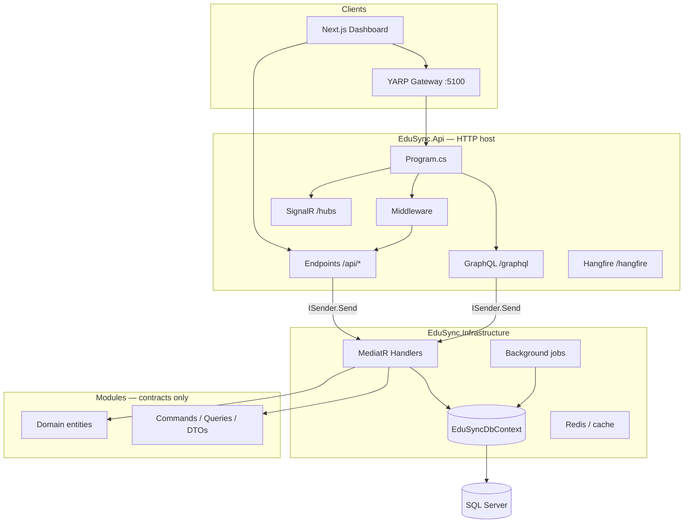
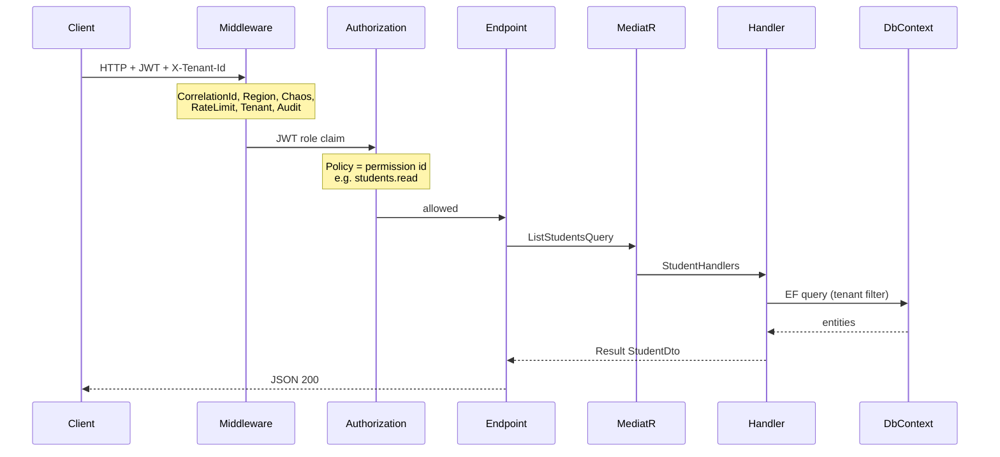
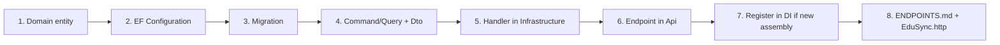

# EduSync Backend — Codebase Guide

Use this document when you need to **find the right file** for a bug, feature, or config change.  
Pair it with [ENDPOINTS.md](ENDPOINTS.md) (API routes) and [SCHEMA.md](SCHEMA.md) (database tables).

---

## 1. Big picture — how the app is shaped

This repo is a **modular monolith**: one deployable API, but code is split into **feature modules** (Students, Fees, etc.) plus shared **Infrastructure**.



**Rule of thumb:**  
- **URL / HTTP** → `EduSync.Api`  
- **Business logic + database** → `EduSync.Infrastructure`  
- **Types & MediatR contracts** → `Modules/EduSync.Modules.*`

---

## 2. Request path (one API call)



**401 vs 403**

| Status | Meaning |
|--------|---------|
| **401** | Missing or invalid JWT (not logged in) |
| **403** | Logged in but **role lacks permission** for this route, or tenant header/context failed |

---

## 3. Repository folder tree (what to open, what to ignore)

```
school-erp-backend/
├── src/
│   ├── EduSync.Api/                 ← START HERE for HTTP routes & startup
│   ├── EduSync.Gateway/             ← YARP proxy (optional entry :5100)
│   ├── EduSync.Infrastructure/      ← START HERE for logic, DB, jobs
│   ├── EduSync.SharedKernel/        ← Shared types (Result, pagination)
│   └── Modules/                     ← Per-feature contracts (no HTTP)
│       └── EduSync.Modules.{Name}/
├── tests/
├── docs/                            ← You are here + ENDPOINTS, SCHEMA, SCALING
├── docker-compose.yml
├── EduSync.http                     ← Sample API calls
├── EduSync.slnx
└── README.md
```

**Ignore when searching code:** `bin/`, `obj/`, `*.Designer.cs` (migration auto-files unless you edit migrations intentionally).

---

## 4. `EduSync.Api` — web host

| Path | Purpose |
|------|---------|
| `Program.cs` | App startup: DI, JWT auth, `AddEduSyncAuthorization()`, middleware order, map `/api` + `/api/v1`, SignalR, GraphQL |
| `appsettings.json` / `appsettings.Development.json` | Connection strings, JWT, Redis, Hangfire, OIDC, encryption, etc. |
| `Endpoints/*.cs` | **Thin routes** — map URL → `ISender.Send(Command/Query)` |
| `Extensions/ApiEndpointExtensions.cs` | Registers all endpoint groups on `/api` and `/api/v1` |
| `Extensions/AuthorizationEndpointExtensions.cs` | `.RequirePermission(...)` on minimal API routes |
| `Extensions/ApiResultExtensions.cs` | Converts `Result<T>` → HTTP status + JSON errors |
| `Middleware/ApiVersionMiddleware.cs` | `X-Api-Version` header validation |
| `Hangfire/` | Dashboard + recurring job registration |
| `SignalR/` | Live notifications hub |
| `GraphQL/Query.cs` | GraphQL queries with `[Authorize(Policy = ...)]` per field |
| `OpenTelemetry/` | Traces & metrics export |

### Endpoint file → feature map

| File | API prefix | When to edit |
|------|------------|--------------|
| `AuthEndpoints.cs` | `/api/auth` | Login, refresh, OIDC, logout |
| `TenantEndpoints.cs` | `/api/tenants` | School onboarding, tenant info |
| `StudentEndpoints.cs` | `/api/students` | Student CRUD |
| `TeacherEndpoints.cs` | `/api/teachers` | Staff / teachers |
| `ParentEndpoints.cs` | `/api/parents` | Parents |
| `AcademicsEndpoints.cs` | `/api/classes`, subjects | Classes & subjects |
| `AdmissionEndpoints.cs` | `/api/admissions` | Admissions workflow |
| `AttendanceEndpoints.cs` | `/api/attendance` | Attendance mark/list |
| `FeesEndpoints.cs` | `/api/fees`, payments | Fees & payments |
| `ExamEndpoints.cs` | `/api/exams` | Exams |
| `TimetableEndpoints.cs` | `/api/timetable` | Timetable |
| `NotificationEndpoints.cs` | `/api/notifications` | Notifications |
| `PayrollEndpoints.cs` | `/api/payroll` | Payroll |
| `LeaveEndpoints.cs` | `/api/leave-requests` | Leave |
| `LibraryEndpoints.cs` | `/api/library` | Books & issues |
| `TransportEndpoints.cs` | `/api/transport` | Vehicles, routes, assignments |
| `HostelEndpoints.cs` | `/api/hostel` | Hostel |
| `InventoryEndpoints.cs` | `/api/inventory` | Inventory |
| `DashboardEndpoints.cs` | `/api/dashboard`, `/api/reports` | KPIs & reports |
| `PortalEndpoints.cs` | `/api/students/me`, `teachers/me`, `parents/me` | Portals |
| `UploadEndpoints.cs` | `/api/uploads` | File upload/download |
| `JobEndpoints.cs` | `/api/jobs` | Fee reminder jobs, job runs |
| `ImportEndpoints.cs` | `/api/imports` | CSV bulk import |
| `EventEndpoints.cs` | `/api/events/outbox` | Integration event outbox |
| `AuditEndpoints.cs` | `/api/audit/logs` | Audit trail |
| `WebhookEndpoints.cs` | `/api/webhooks` | Webhook subscriptions |
| `RetentionEndpoints.cs` | `/api/retention` | Data retention policies |
| `RegionEndpoints.cs` | `/api/region` | Multi-region info |
| `VersionEndpoints.cs` | `/api/version` | API version metadata |
| `ChaosEndpoints.cs` | `/api/chaos` | Chaos testing config |

Most routes call `.RequirePermission(Permissions.*)` on each `MapGet` / `MapPost` / etc. **Exceptions:** `AuthEndpoints` login/refresh (anonymous), `AdmissionEndpoints` public apply flow (anonymous), `TenantEndpoints` provision/slug lookup (anonymous).

---

## 5. `EduSync.Infrastructure` — brain of the app

| Path | Purpose |
|------|---------|
| `DependencyInjection.cs` | Registers DbContext, MediatR, validators, all `Phase*ServiceExtensions` |
| `Authorization/` | `PermissionService`, `PermissionAuthorizationHandler`, `AddEduSyncAuthorization()` |
| `Persistence/EduSyncDbContext.cs` | All `DbSet<>` + tenant filters + outbox on save |
| `Persistence/Migrations/` | EF Core SQL migrations — **new column/table** |
| `Persistence/Configurations/` | Table names, indexes, column types per entity |
| `Persistence/SeedData.cs` | Demo tenant seed on startup |
| `Application/{Feature}/*Handlers.cs` | **MediatR handlers** — real business logic |
| `Middleware/` | Cross-cutting HTTP (tenant, audit, rate limit, region, chaos) |
| `Jobs/` | Fee reminder job logic |
| `Events/` | Outbox + integration event dispatch |
| `Storage/` | Local / Azure / S3 file storage |
| `Reports/ReportExporter.cs` | CSV & PDF export |
| `Security/` | Field encryption, OIDC token validation |
| `Caching/` | Redis tenant/dashboard cache |
| `Compliance/` | Data retention background service |
| `Phase7ServiceExtensions.cs` … `Phase10ServiceExtensions.cs` | Feature bundles registered in DI |

### Handler file → module map

| Handler folder / file | Edit when… |
|----------------------|------------|
| `Application/Identity/` | Auth, JWT users, login, OIDC, `AuthUserMapper` (role + permissions in `/me`) |
| `Application/Tenancy/` | Provision tenant, current tenant |
| `Application/Students/` | Student list/create/update/delete |
| `Application/Staff/` | Teachers |
| `Application/Parents/` | Parents |
| `Application/Academics/` | Classes, subjects |
| `Application/Admissions/` | Admissions |
| `Application/Attendance/` | Attendance |
| `Application/Fees/` | Fees & payments |
| `Application/Exams/` | Exams |
| `Application/Timetable/` | Timetable |
| `Application/Notifications/` | Notifications + SignalR publish |
| `Application/Payroll/` | Payroll |
| `Application/Leave/` | Leave requests |
| `Application/Library/` | Library |
| `Application/Transport/` | Transport |
| `Application/Hostel/` | Hostel |
| `Application/Inventory/` | Inventory |
| `Application/Dashboard/` | Dashboard KPIs & report queries |
| `Application/Portals/` | Student/teacher/parent portal views |
| `Application/Uploads/` | File metadata & storage |
| `Application/Jobs/` | Manual job triggers, list runs |
| `Application/Imports/` | CSV import |
| `Application/Events/` | List outbox messages |
| `Application/Audit/` | List audit logs |
| `Application/Webhooks/` | Webhook CRUD |
| `Application/Compliance/` | Retention policies & cleanup |

---

## 6. `Modules/` — feature contracts (pattern)

Every feature module follows the same layout. **Handlers live in Infrastructure**, not here.

```
EduSync.Modules.Students/
├── Domain/
│   └── Student.cs              ← DB entity shape, properties
├── Application/
│   ├── Commands/               ← CreateStudentCommand, Update…
│   ├── Queries/                ← ListStudentsQuery, GetById…
│   ├── Dtos/                   ← StudentDto returned to API
│   └── StudentMapping.cs       ← Entity → DTO (basic; encryption in Infra)
└── EduSync.Modules.Students.csproj
```

| Layer | You change it when… |
|-------|---------------------|
| `Domain/` | New field on entity, new table entity, status enums |
| `Application/Commands` | New write operation contract (+ validator) |
| `Application/Queries` | New read operation contract |
| `Application/Dtos` | API response/request shape |

After changing `Domain/`, you almost always need:

1. `Persistence/Configurations/{Entity}Configuration.cs`  
2. New migration: `dotnet ef migrations add YourName --project src/EduSync.Infrastructure --startup-project src/EduSync.Api`  
3. Handler + Endpoint updates  

---

## 7. All feature modules (quick index)

| Module folder | Business area |
|---------------|----------------|
| `EduSync.Modules.Identity` | Users, roles, JWT, refresh tokens, `Authorization/Permissions` + `RolePermissions` |
| `EduSync.Modules.Tenancy` | Schools / tenants |
| `EduSync.Modules.Students` | Students |
| `EduSync.Modules.Staff` | Teachers |
| `EduSync.Modules.Parents` | Parents |
| `EduSync.Modules.Academics` | Classes, subjects |
| `EduSync.Modules.Admissions` | Admission applications |
| `EduSync.Modules.Attendance` | Attendance records |
| `EduSync.Modules.Fees` | Fee invoices & payments |
| `EduSync.Modules.Exams` | Exams |
| `EduSync.Modules.Timetable` | Timetable |
| `EduSync.Modules.Notifications` | Notifications |
| `EduSync.Modules.Payroll` | Payroll |
| `EduSync.Modules.Leave` | Leave |
| `EduSync.Modules.Library` | Library |
| `EduSync.Modules.Transport` | Transport |
| `EduSync.Modules.Hostel` | Hostel |
| `EduSync.Modules.Inventory` | Inventory |
| `EduSync.Modules.Dashboard` | Dashboard & reports |
| `EduSync.Modules.Portals` | Portal queries |
| `EduSync.Modules.Uploads` | File uploads |
| `EduSync.Modules.Jobs` | Job execution records |
| `EduSync.Modules.Imports` | CSV import commands |
| `EduSync.Modules.Events` | Outbox messages |
| `EduSync.Modules.Audit` | Audit logs |
| `EduSync.Modules.Webhooks` | Webhook subscriptions |
| `EduSync.Modules.Compliance` | Retention policies |

---

## 8. `EduSync.SharedKernel`

| Path | Purpose |
|------|---------|
| `Results/Result.cs`, `Error.cs` | Success/failure pattern for handlers |
| `Pagination/` | `PaginationQuery`, `PaginatedList` |
| `Entities/` | `TenantEntity`, `AuditableEntity` base classes |
| `Constants/HttpHeaders.cs` | `X-Tenant-Id`, `X-Region`, `X-Correlation-Id` |
| `Abstractions/ITenantEntity.cs` | Marks entities that get tenant SQL filter |

---

## 9. `EduSync.Gateway`

| Path | Purpose |
|------|---------|
| `Program.cs` | YARP reverse proxy to API |
| `appsettings.json` | Routes `/api`, `/api/v1`, `/hubs`, `/graphql` → backend URL |

Change when frontend should hit gateway port **5100** instead of API **5000**.

---

## 10. Tests & ops files

| Path | Purpose |
|------|---------|
| `tests/EduSync.IntegrationTests/` | SQL Testcontainers, tenant isolation, RBAC (e.g. student → 403 on `/api/students`) |
| `tests/EduSync.UnitTests/` | Unit tests incl. `RolePermissionsTests` |
| `tests/EduSync.ArchitectureTests/` | Layer dependency rules |
| `docker-compose.yml` | SQL Server, Redis, API, Gateway |
| `Dockerfile` / `Dockerfile.gateway` | Container images |

---

## 11. “I have a problem — where do I change?”

Use this table first. Then open the **Endpoint** (URL) and matching **Handler**.

| Problem / task | Primary files |
|----------------|---------------|
| **New REST endpoint** | `Api/Endpoints/{Feature}Endpoints.cs`, `Api/Extensions/ApiEndpointExtensions.cs`, Module `Application/Commands` or `Queries`, `Infrastructure/Application/{Feature}/*Handlers.cs` |
| **Change URL or HTTP method** | `Api/Endpoints/*Endpoints.cs` only |
| **401 / 403 / tenant not found** | `Middleware/TenantResolutionMiddleware.cs`, `Application/Identity/`, request headers `X-Tenant-Id` |
| **403 but tenant is correct (role)** | `Modules.Identity/Authorization/Permissions.cs`, `RolePermissions.cs`, endpoint `.RequirePermission(...)`, JWT `ClaimTypes.Role` from **tenant membership** |
| **Login / JWT / password** | `Application/Identity/LoginCommandHandler.cs`, `Modules.Identity/Infrastructure/JwtTokenService.cs`, `appsettings` `Jwt` |
| **OIDC / SSO login** | `AuthEndpoints.cs`, `Application/Identity/OidcLoginCommandHandler.cs`, `Security/OidcTokenValidator.cs`, `Oidc` config |
| **Wrong data for one school only** | Tenant filter — entity must implement `ITenantEntity`; check `TenantId` in handler |
| **New DB column or table** | `Modules.*/Domain/`, `Persistence/Configurations/`, new file in `Persistence/Migrations/`, `EduSyncDbContext.cs` `DbSet` |
| **Slow list / report query** | Matching `*Handlers.cs` list handler; consider read DB: `IReadDbContextFactory` (see `EduSyncReadDbContextFactory.cs`) |
| **CSV/PDF export wrong** | `Reports/ReportExporter.cs`, `Application/Dashboard/DashboardHandlers.cs` |
| **File upload fails** | `Application/Uploads/`, `Storage/*FileStorageService.cs`, `Uploads` config |
| **Background fee reminders** | `Jobs/FeeReminderJob.cs`, `Jobs/FeeReminderScheduler.cs`, `Api/Hangfire/`, `ScheduledJobs` config |
| **Email/notification not realtime** | `Application/Notifications/`, `Api/SignalR/`, `Events/*` outbox |
| **Webhook not firing** | `Events/WebhookIntegrationEventHandler.cs`, `Application/Webhooks/`, outbox dispatcher |
| **Integration event not sent** | `Events/IntegrationEventCollector.cs`, `EduSyncDbContext.SaveChangesAsync`, handler that calls `events.Add(...)` |
| **Audit missing** | `Middleware/AuditLoggingMiddleware.cs`, `Audit` config |
| **Old data not deleted** | `Application/Compliance/`, `Compliance/DataRetentionBackgroundService.cs`, `Retention` config |
| **Student PII / encryption** | `Security/FieldEncryptionService.cs`, `Application/Students/StudentSensitiveFields.cs`, `Encryption` config |
| **Redis / cache** | `Caching/`, `Phase7ServiceExtensions.cs`, `Redis` config |
| **Rate limit 429** | `Middleware/TenantRateLimitMiddleware.cs` |
| **Random 503 in dev** | `Middleware/ChaosMiddleware.cs`, `Chaos` config |
| **CORS errors from frontend** | `Program.cs` `Cors` policy, `appsettings` `Cors:Origins` |
| **Swagger/OpenAPI** | `Program.cs`; endpoints are auto-discovered from minimal APIs |
| **GraphQL query** | `Api/GraphQL/Query.cs`, underlying MediatR queries |
| **Config / connection string** | `Api/appsettings.Development.json` (local), env vars in Docker |
| **Demo data wrong** | `Persistence/SeedData.cs` |
| **Frontend route mapping** | `docs/ENDPOINTS.md` (not code — keep in sync when you add APIs) |

---

## 12. Adding a new feature (checklist)



1. Create or extend `Modules/EduSync.Modules.{Feature}/`  
2. Add `DbSet<>` + configuration + migration  
3. Implement handler in `Infrastructure/Application/{Feature}/`  
4. Add `*Endpoints.cs` and wire in `ApiEndpointExtensions.cs`  
5. Register MediatR/validators in `DependencyInjection.cs` if new module project  
6. Add `.RequirePermission(...)` on each route in `*Endpoints.cs` (and GraphQL policy if exposed)  
7. Update `Permissions.cs`, `RolePermissions.cs`, and `Permissions.All` if new permission  
8. Update `docs/ENDPOINTS.md` and test with `EduSync.http` (try admin + teacher + student tokens)  

---

## 13. Middleware order (matters for bugs)

Order in `Program.cs` (first to last for incoming request):

1. Serilog request logging  
2. `CorrelationIdMiddleware`  
3. `ApiVersionMiddleware`  
4. `RegionResolutionMiddleware`  
5. `ChaosMiddleware`  
6. `ExceptionHandlingMiddleware`  
7. CORS → Authentication → Authorization  
8. `TenantRateLimitMiddleware`  
9. `TenantResolutionMiddleware`  
10. `AuditLoggingMiddleware` (runs after endpoint; logs on way out)  

If tenant is missing, fix **step 9** and client headers before handlers.

---

## 14. Configuration sections (`appsettings`)

| Section | Controls |
|---------|----------|
| `ConnectionStrings` | SQL primary (`Min/Max Pool Size` in production); see [CAPACITY.md](CAPACITY.md) |
| `Capacity` | Target schools/users; `SingleDatabase=true` forces one connection |
| `Database` | `UseReadReplica` (off for single DB), `CommandTimeoutSeconds` |
| `Jwt` | Token signing |
| `Cors` | Allowed frontend origins |
| `Uploads` | Local / Azure / S3 storage |
| `ScheduledJobs` | Fee reminders, Hangfire vs hosted service |
| `Redis` | Cache, rate limit, SignalR backplane |
| `Database` | Read replica routing |
| `SignalR` | Live hub on/off |
| `Outbox` | Integration event dispatcher |
| `MultiRegion` | `X-Region` |
| `OpenTelemetry` | Tracing export |
| `Audit` | HTTP audit logging |
| `Chaos` | Fault injection (dev) |
| `Oidc` | SSO |
| `Encryption` | Student field encryption |
| `Retention` | Data cleanup |
| `GraphQL` | GraphQL endpoint on/off |

---

## 15. RBAC (roles & permissions)

Permission-based access control is **enforced on every protected API route** (and GraphQL fields). Policies are registered in `Program.cs` via `AddEduSyncAuthorization()`.

### Roles (tenant membership)

| Role | Scope |
|------|--------|
| `admin` | All permissions, including `webhooks.manage`, `retention.manage`, `chaos.read` |
| `principal` | Full school operations (students, fees, payroll, imports, jobs, audit, …) — **not** admin-only permissions above |
| `teacher` | Read students; write attendance/exams; read/write library; leave create; dashboard & reports; uploads; **teacher portal only** |
| `student` | **Student portal** (`/api/students/me/*`) + `tenants.read` |
| `parent` | **Parent portal** (`/api/parents/me/*`) + `tenants.read` |

Roles are defined in `Modules.Identity/Domain/UserRole.cs` (`UserRoles` constants).

### How it works

1. **Login** (`POST /api/auth/login`) loads the user’s active `TenantMembership` and puts **`membership.Role`** into the JWT (`ClaimTypes.Role`), not `User.Role`.
2. **Authorization** runs after authentication (`Program.cs` order: Authentication → Authorization → tenant middleware).
3. Each route uses `.RequirePermission("resource.action")` — the policy name **is** the permission string.
4. `PermissionAuthorizationHandler` resolves the role from the JWT and checks `RolePermissions.HasPermission(role, permission)`.
5. **`GET /api/auth/me`** returns `user.role` and `user.permissions[]` for the Next.js dashboard to hide menus/actions.

### Demo users (tenant `demo-school-001`)

| Email | Password | Role |
|-------|----------|------|
| `admin@school.edu` | `admin123` | admin |
| `principal@school.edu` | `principal123` | principal |
| `anita.s@school.edu` | `teacher123` | teacher |
| `arjun.s@school.edu` | `student123` | student |
| `rajesh.sharma@email.com` | `parent123` | parent |

Always send `X-Tenant-Id: demo-school-001` (or your tenant slug/external id) with authenticated calls.

### Permission ids (reference)

| Area | Read | Write / other |
|------|------|----------------|
| Students | `students.read` | `students.write`, `students.delete` |
| Teachers | `teachers.read` | `teachers.write`, `teachers.delete` |
| Parents | `parents.read` | `parents.write`, `parents.delete` |
| Academics | `academics.read` | `academics.write` |
| Admissions (staff) | `admissions.read` | `admissions.manage` (status patch); public apply routes stay **anonymous** |
| Attendance | `attendance.read` | `attendance.write` |
| Fees / payments | `fees.read`, `payments.read` | `fees.write` |
| Exams | `exams.read` | `exams.write` |
| Timetable | `timetable.read` | `timetable.write` |
| Notifications | `notifications.read` | `notifications.write` |
| Payroll | `payroll.read` | `payroll.write`, `payroll.process` |
| Leave | `leave.read` | `leave.write`, `leave.approve` |
| Library | `library.read` | `library.write` |
| Transport | `transport.read` | `transport.write` |
| Hostel | `hostel.read` | `hostel.write` |
| Inventory | `inventory.read` | `inventory.write` |
| Dashboard / reports | `dashboard.read`, `reports.read` | `reports.export` |
| Uploads | `uploads.read` | `uploads.write` |
| Jobs / imports | — | `jobs.run`, `imports.run` |
| Ops (mostly admin) | `events.read`, `audit.read`, `chaos.read` | `webhooks.manage`, `retention.manage` |
| Tenant context | `tenants.read` | — |
| Portals | `portal.student`, `portal.teacher`, `portal.parent` | — |

Source of truth: `src/Modules/EduSync.Modules.Identity/Authorization/Permissions.cs`.

### Endpoint → typical permission

| Endpoint file | Group policy pattern |
|---------------|----------------------|
| `StudentEndpoints` | read / write / delete per HTTP method |
| `PortalEndpoints` | one portal permission per `*/me` group |
| `ImportEndpoints` | entire group: `imports.run` |
| `JobEndpoints` | entire group: `jobs.run` |
| `WebhookEndpoints` | entire group: `webhooks.manage` (admin) |
| `RetentionEndpoints` | entire group: `retention.manage` (admin) |
| `AuditEndpoints` | `audit.read` |
| `AuthEndpoints` | `/me`, `/logout`: authenticated only (no permission id) |

Hangfire dashboard (`/hangfire`): non-dev requires `jobs.run` (see `HangfireDashboardAuthorizationFilter.cs`).

### Key files

| File | Purpose |
|------|---------|
| `Modules.Identity/Authorization/Permissions.cs` | Permission constants + `Permissions.All` |
| `Modules.Identity/Authorization/RolePermissions.cs` | Role → permission matrix |
| `Modules.Identity/Application/Abstractions/IPermissionService.cs` | Permission lookup abstraction |
| `Infrastructure/Authorization/AuthorizationServiceExtensions.cs` | Registers policies + handler |
| `Infrastructure/Authorization/PermissionAuthorizationHandler.cs` | Enforces permission on each policy |
| `Infrastructure/Application/Identity/AuthUserMapper.cs` | Builds `permissions[]` for login & `/me` |
| `Api/Extensions/AuthorizationEndpointExtensions.cs` | `.RequirePermission()` helper |

### Add or change access

1. Add constant in `Permissions.cs` and list it in `Permissions.All`.  
2. Grant to roles in `RolePermissions.BuildMap()`.  
3. Apply `.RequirePermission(Permissions.YourPermission)` on the route (or `[Authorize(Policy = ...)]` in GraphQL).  
4. Extend `RolePermissionsTests` and hit the API with two roles in `EduSync.http`.  

**Not in scope today:** per-tenant custom roles stored in SQL (matrix is code-defined). To add that later, introduce role/permission tables and replace `RolePermissions` with a DB-backed `IPermissionService`.

---

## 16. Editor / repo hygiene (Windows)

If Visual Studio shows **“Inconsistent Line Endings”** on a file (common after bulk edits), choose **Yes** and normalize to **Windows (CR LF)** unless your team standard is LF everywhere.

To keep the repo consistent, you can add a root `.editorconfig`:

```ini
root = true

[*]
end_of_line = crlf
charset = utf-8
insert_final_newline = true
```

This does not affect runtime behavior.

---

## 17. Related docs

| Document | Use for |
|----------|---------|
| [ENDPOINTS.md](ENDPOINTS.md) | Frontend path ↔ backend path |
| [SCHEMA.md](SCHEMA.md) | SQL schemas & tables |
| [ERD.md](ERD.md) | Entity relationship diagrams (Mermaid) |
| [CAPACITY.md](CAPACITY.md) | 200 schools × 300 concurrent, single-database production profile |
| [SCALING.md](SCALING.md) | Redis, replicas, microservice extraction |
| [README.md](../README.md) | Run locally, phases 1–10, Docker |

---

*Last updated: phases 1–10, full permission-based RBAC on REST + GraphQL, JWT tenant membership role, demo users, and Windows line-ending note.*
