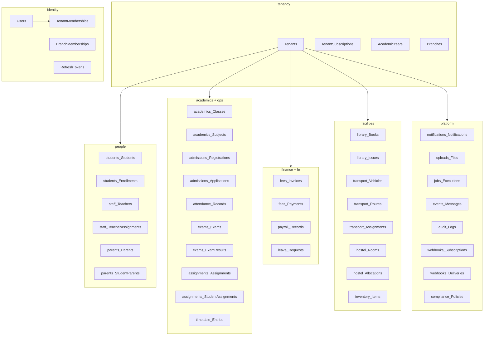
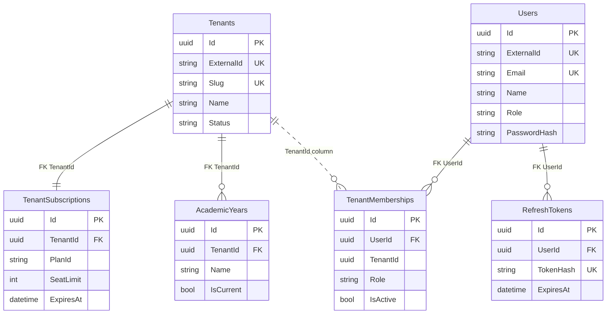
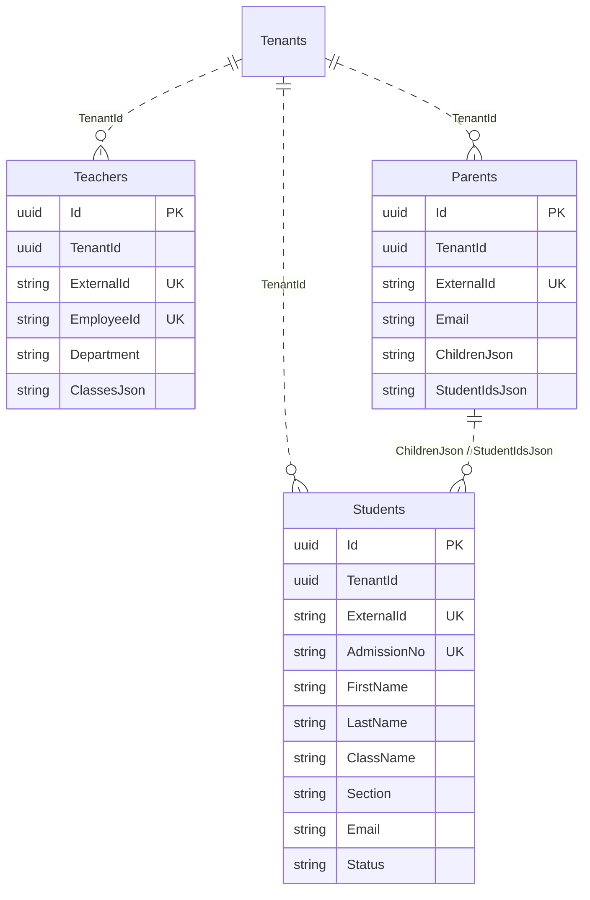
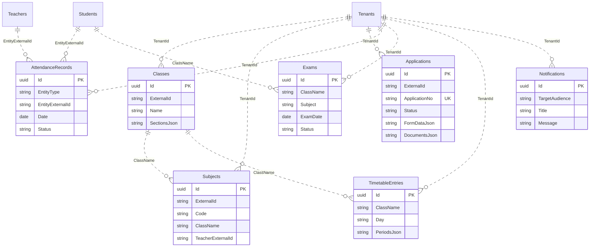
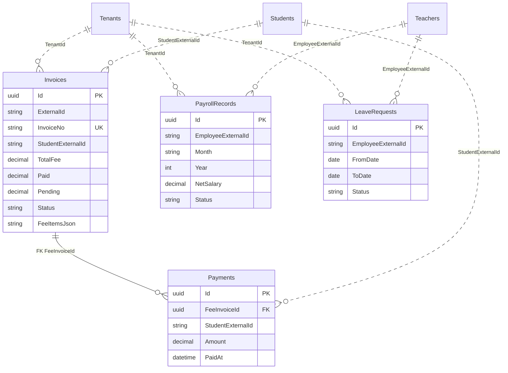
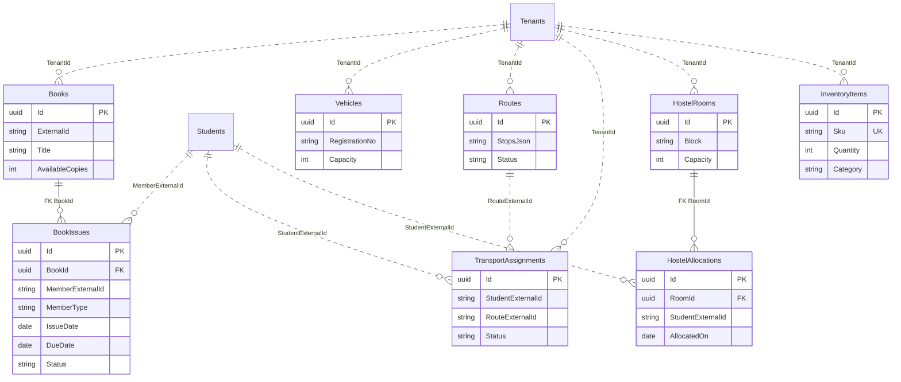
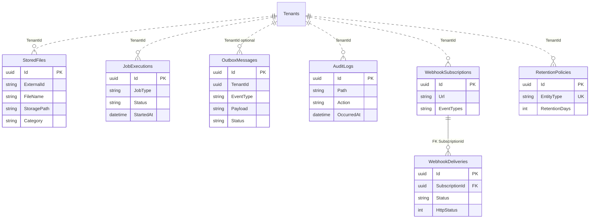
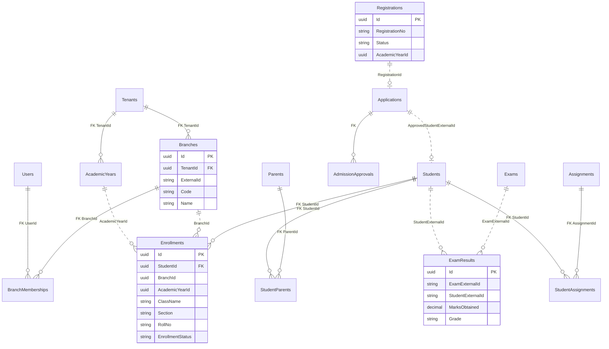

# EduSync — Entity Relationship Diagrams (ERD)

One **SQL Server database**, many **schemas** (modules). Almost every business table is **tenant-scoped** via `TenantId`.

**How to read these diagrams**

| Line style | Meaning |
|------------|---------|
| Solid (`--`) | **Database foreign key** enforced in SQL |
| Dotted (`..`) | **Logical link** — string `ExternalId` / JSON; app validates, SQL does not enforce |

**Common columns on tenant tables** (not repeated on every box):

- `TenantId`, `CreatedAt`, `UpdatedAt`, `CreatedBy`, `UpdatedBy`, `RowVersion`, `IsDeleted`

---

## 1. High-level — schemas in one database

---

## 2. Tenancy & identity (who can log in)

**Notes**

- JWT role comes from **`TenantMemberships.Role`**, not `Users.Role`.
- `Users` are global; **membership** ties a user to one school (tenant).

---

## 3. People — students, teachers, parents

**Notes**

- Parent ↔ student is **denormalized JSON**, not a join table.
- Portal users often match `Users.ExternalId` to `Students.ExternalId` or parent record.

---

## 4. Academics & daily school operations

---

## 5. Finance & HR

**Notes**

- **Only solid FK in finance:** `Payments` → `Invoices`.
- Student on invoice is a **string reference**, not FK.

---

## 6. Library, transport, hostel, inventory

**Solid FKs here:** `BookIssues` → `Books`, `HostelAllocations` → `HostelRooms`.

---

## 7. Platform & integration

---

## 8. Full picture — tenant at the center

```mermaid
erDiagram
    Tenants ||--|| TenantSubscriptions : has
    Tenants ||--o{ AcademicYears : has
    Users ||--o{ TenantMemberships : member
    Tenants ||..o{ TenantMemberships : scoped
    Users ||--o{ RefreshTokens : has

    Tenants ||..o{ Students : owns
    Tenants ||..o{ Teachers : owns
    Tenants ||..o{ Parents : owns
    Tenants ||..o{ Classes : owns
    Tenants ||..o{ Subjects : owns
    Tenants ||..o{ Applications : owns
    Tenants ||..o{ AttendanceRecords : owns
    Tenants ||..o{ Invoices : owns
    Invoices ||--o{ Payments : has
    Tenants ||..o{ Exams : owns
    Tenants ||..o{ TimetableEntries : owns
    Tenants ||..o{ Notifications : owns
    Tenants ||..o{ PayrollRecords : owns
    Tenants ||..o{ LeaveRequests : owns
    Tenants ||..o{ Books : owns
    Books ||--o{ BookIssues : has
    Tenants ||..o{ Vehicles : owns
    Tenants ||..o{ Routes : owns
    Tenants ||..o{ TransportAssignments : owns
    Tenants ||..o{ HostelRooms : owns
    HostelRooms ||--o{ HostelAllocations : has
    Tenants ||..o{ InventoryItems : owns
    Tenants ||..o{ StoredFiles : owns
    Tenants ||..o{ JobExecutions : owns
    Tenants ||..o{ OutboxMessages : owns
    Tenants ||..o{ AuditLogs : owns
    Tenants ||..o{ WebhookSubscriptions : owns
    WebhookSubscriptions ||--o{ WebhookDeliveries : has
    Tenants ||..o{ RetentionPolicies : owns

    Students ||..o{ Invoices : StudentExternalId
    Students ||..o{ AttendanceRecords : EntityExternalId
    Students ||..o{ TransportAssignments : StudentExternalId
    Parents ||..o{ Students : JSON children
```

---

## 9. Design patterns in this model

### Multi-tenancy

- Every school = row in `tenancy.Tenants`.
- Business data filtered by **`TenantId`** (EF global query filter).
- API sends **`X-Tenant-Id`** → resolves to `TenantId`.
- Optional **`X-Branch-Id`** → `BranchId` for branch-scoped entities.
- Optional **`X-Academic-Year-Id`** / **`X-Financial-Year`** → current academic year context.

### External IDs

- Frontend uses string ids like `"1"`, `"admin"` → stored as **`ExternalId`** per tenant.
- Unique per tenant: `(TenantId, ExternalId)`.

### Modular monolith

- Each module = SQL **schema** (`students`, `fees`, …).
- Few **cross-schema FKs**; modules link via **`ExternalId` strings** to stay loosely coupled.

### JSON columns

| Table | JSON field | Purpose |
|-------|------------|---------|
| `admissions.Applications` | `FormDataJson`, `DocumentsJson` | Application wizard (still JSON) |
| `academics.Classes` | `SectionsJson` | Sections A/B/C |
| `fees.Invoices` | `FeeItemsJson` | Line items |
| `timetable.Entries` | `PeriodsJson` | Period schedule |
| `transport.Routes` | `StopsJson` | Bus stops |

### Real FKs (enforced in SQL)

| Child | Parent |
|-------|--------|
| `identity.TenantMemberships` | `identity.Users` |
| `identity.RefreshTokens` | `identity.Users` |
| `tenancy.TenantSubscriptions` | `tenancy.Tenants` |
| `tenancy.AcademicYears` | `tenancy.Tenants` |
| `fees.Payments` | `fees.Invoices` |
| `library.Issues` | `library.Books` |
| `hostel.Allocations` | `hostel.Rooms` |
| `webhooks.Deliveries` | `webhooks.Subscriptions` |
| `identity.BranchMemberships` | `tenancy.Branches`, `identity.Users` |
| `students.Enrollments` | `students.Students` |
| `parents.StudentParents` | `students.Students`, `parents.Parents` |
| `assignments.StudentAssignments` | `assignments.Assignments` |
| `admissions.AdmissionApprovals` | `admissions.Applications` |

**Normalized (replaces JSON):** parent ↔ student links use `parents.StudentParents`; teacher class assignments use `staff.TeacherAssignments`; student class/section uses `students.Enrollments`.

---

## 10. ERP core — branches, enrollments, admissions (phases 11–12)

**Lifecycle flows**

1. **Registration** → submit → (optional verify) → convert → **AdmissionApplication** (draft)
2. **Admission** → submit → approve → **Student** + **Enrollment** + outbox `admission.approved`
3. **Promotion** → `PromotionBatch` closes prior enrollment, opens new year enrollment
4. **Assignments** → teacher creates → `StudentAssignment` rows per enrolled student → portal submit

---

## 11. View in tools

- **Markdown preview** in VS Code / GitHub renders Mermaid diagrams in this file.
- **Azure Data Studio / SSMS**: connect to DB → Database Diagrams (physical tables only).
- **Table list**: [SCHEMA.md](SCHEMA.md)

---

## Related

- [SCHEMA.md](SCHEMA.md) — table list by schema
- [CODEBASE_GUIDE.md](CODEBASE_GUIDE.md) — where entities and handlers live
- [ENDPOINTS.md](ENDPOINTS.md) — REST routes for branches, registrations, assignments, exam results

*Last updated: phases 11–12 ERP architecture (branches, enrollments, exam results, assignments).*
