# SQL schema overview (Phase 1–5)

Shared database, schema-separated modules. All tenant-bound tables include `TenantId` (uniqueidentifier) and audit columns.

## `tenancy`

| Table | Purpose |
|-------|---------|
| `Tenants` | School tenant: Id, ExternalId, Slug, Name, LogoUrl, Status |
| `TenantSubscriptions` | PlanId, SeatLimit, ExpiresAt, FeatureFlagsJson |
| `AcademicYears` | Indian Apr–Mar year per tenant |

## `identity`

| Table | Purpose |
|-------|---------|
| `Users` | Global user; ExternalId for frontend `userId` |
| `TenantMemberships` | User ↔ Tenant + role |
| `RefreshTokens` | Hashed rotating refresh tokens |

## `students`

| Table | Purpose |
|-------|---------|
| `Students` | Tenant-scoped student records; soft delete via `IsDeleted` |

Indexes: leading `TenantId` on filtered tables; unique `(TenantId, ExternalId)`, `(TenantId, AdmissionNo)`.

## `staff`

| Table | Purpose |
|-------|---------|
| `Teachers` | Staff / teachers; `ClassesJson` for assigned classes |

## `parents`

| Table | Purpose |
|-------|---------|
| `Parents` | Guardian records; `ChildrenJson`, `StudentIdsJson` |

## `academics`

| Table | Purpose |
|-------|---------|
| `Classes` | Grade levels; `SectionsJson` |
| `Subjects` | Subject per class; optional teacher link |

## `admissions`

| Table | Purpose |
|-------|---------|
| `Applications` | Multi-step form in `FormDataJson`; documents in `DocumentsJson`; status workflow |

## `attendance`

| Table | Purpose |
|-------|---------|
| `Records` | Daily attendance per entity (student/staff); status, check-in/out |

## `fees`

| Table | Purpose |
|-------|---------|
| `Invoices` | Fee invoice per student; totals, status, optional `FeeItemsJson` |
| `Payments` | Payment lines linked to invoice |

## `exams`

| Table | Purpose |
|-------|---------|
| `Exams` | Exam schedule: subject, class, date, marks, status |

## `timetable`

| Table | Purpose |
|-------|---------|
| `Entries` | Class + day schedule; periods in `PeriodsJson` |

## `notifications`

| Table | Purpose |
|-------|---------|
| `Notifications` | Broadcast messages; read counts, target audience |

## `payroll`

| Table | Purpose |
|-------|---------|
| `Records` | Monthly salary runs per employee |

## `leave`

| Table | Purpose |
|-------|---------|
| `Requests` | Staff leave applications and approvals |

## `library`

| Table | Purpose |
|-------|---------|
| `Books` | Catalog |
| `Issues` | Issue/return tracking |

## `transport`

| Table | Purpose |
|-------|---------|
| `Vehicles` | Fleet |
| `Routes` | Routes with optional `StopsJson` |

## `hostel`

| Table | Purpose |
|-------|---------|
| `Rooms` | Room inventory |
| `Allocations` | Student room assignments |

## `inventory`

| Table | Purpose |
|-------|---------|
| `Items` | Stock items with SKU |

## `compliance`

| Table | Purpose |
|-------|---------|
| `compliance.Policies` | Per-tenant retention days by entity type |

## `audit`

| Table | Purpose |
|-------|---------|
| `audit.Logs` | HTTP request audit trail per tenant |

## `webhooks`

| Table | Purpose |
|-------|---------|
| `webhooks.Subscriptions` | Tenant webhook URLs + event filters |
| `webhooks.Deliveries` | Outbound delivery attempts |

## `events`

| Table | Purpose |
|-------|---------|
| `events.Messages` | Transactional outbox for integration events (`pending` → `processed`) |

## `uploads`

| Table | Purpose |
|-------|---------|
| `Files` | Uploaded file metadata and disk path |

## `jobs`

| Table | Purpose |
|-------|---------|
| `Executions` | Background job run history per tenant |

## `transport` (assignments)

| Table | Purpose |
|-------|---------|
| `Assignments` | Student ↔ route enrollment |

## ER (Phase 1–5)

```mermaid
erDiagram
    Tenants ||--o| TenantSubscriptions : has
    Tenants ||--o{ AcademicYears : has
    Tenants ||--o{ TenantMemberships : has
    Users ||--o{ TenantMemberships : has
    Users ||--o{ RefreshTokens : has
    Tenants ||--o{ Students : owns
    Tenants ||--o{ Teachers : owns
    Tenants ||--o{ Parents : owns
    Tenants ||--o{ Classes : owns
    Tenants ||--o{ Subjects : owns
    Tenants ||--o{ Applications : owns
    Tenants ||--o{ Records : owns
    Tenants ||--o{ Invoices : owns
    Invoices ||--o{ Payments : has
    Tenants ||--o{ Exams : owns
    Tenants ||--o{ Entries : owns
    Tenants ||--o{ Notifications : owns
    Tenants ||--o{ Records : payroll
    Tenants ||--o{ Requests : leave
    Tenants ||--o{ Books : owns
    Books ||--o{ Issues : has
    Tenants ||--o{ Vehicles : owns
    Tenants ||--o{ Routes : owns
    Tenants ||--o{ Rooms : hostel
    Rooms ||--o{ Allocations : has
    Tenants ||--o{ Items : inventory
    Tenants ||--o{ Files : uploads
    Tenants ||--o{ Executions : jobs
    Tenants ||--o{ Assignments : transport
```

